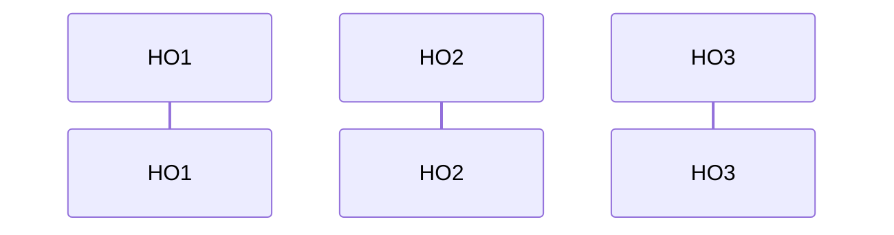

# ルーティング

----

## Day1

### HO1
- [ ] 定期メンタルケアのために御先稲荷のもとへ訪れる
- [ ] 日本支部理事会からの指令を確認する

### HO2
- [ ] 「首輪」の注射器に使用する薬剤を完成させる
- [ ] 虎屋外郎と共に「首輪」の納品に立ち会う

### HO3
- [ ] 「鵺」から渡された暗号を四葉薊に渡す
- [ ] 四葉薊から内容を見たか確認される

## Day2

### HO1
- [ ] 御先稲荷をサイト-8141へ送り届ける

### HO2
- [ ] 虎屋外郎と共にサイト-8141を訪れる
- [ ] 四葉薊が虎屋外郎のもとに訪れた姿を目撃する
- [ ] 四葉薊と虎屋外郎の密談を聴く

### HO3
- [ ] 「鵺」の使いとしてサイト-8141を訪れる
- [ ] 四葉薊の姿を目撃する

### 共通
- [ ] 施設内で探索者が対面する
- [ ] 四葉薊が御先稲荷を抱きかかえて施設保安職員から逃走する姿を目撃する
- [ ] 四葉薊を止めようとした際に暗号を解読するよう耳打ちされる
- [ ] 聴取のため24時間サイト-8141から立ち去ることを禁じられる

## Day3

### 共通
- [ ] 暗号の内容を知る
- [ ] 暗号に指定されていた場所でカセットテープを入手する
- [ ] A面に記録された音声を聴く
- [ ] B面に記録された音声を聴く
- [ ] HO2にカセットテープを任せる
- [ ] サイト-8141を立ち去る

## Day4

### HO2
- [ ] 虎屋外郎のもとを訪れる
- [ ] 虎屋外郎に合言葉を伝える
- [ ] オシロスコープと繋がったラジカセにカセットテープのB面を差し込む
- [ ] HO3にカセットテープのB面の内容を伝える

### HO3
- [ ] 「鵺」に連絡して通信監視システム外の専用回線の使用申請を出す
- [ ] 四葉薊と連絡を行い待ち合わせの約束をする
- [ ] HO1とHO2に四葉薊との待ち合わせの約束を伝える

## Day5

### 共通
- [ ] 四葉薊との待ち合わせ場所を訪れる
- [ ] 四葉薊の使いの者を自称する人物が現れる
- [ ] 飯縄山山中の洞窟で四葉薊・御先稲荷と再会する

### HO1
- [ ] なぜ御先稲荷を拉致したのかを聞く

### HO2
- [ ] なぜ虎屋外郎にラジカセを渡したのかを聞く

### HO3
- [ ] なぜ探索者たちを選んだのかを聞く

### 共通
- [ ] 白狐計画を知る
- [ ] 白虎計画を知る
- [ ] ラストリゾート作戦を知る

## Day6

### 共通
- [ ] SRDTIPを埋め込まれる
- [ ] 表象領域で訓練を受ける

## Day7

### 共通
- [ ] 四葉薊・ラストリゾート・御先稲荷と共にサイト-8141を襲撃する
- [ ] 四葉薊・ラストリゾートと別れる
- [ ] 「夜叉」のチャンバーに入室する
- [ ] 御先稲荷と共に表象サーバーにアクセスする
- [ ] 「夜叉」の尾を9本焼く
- [ ] 「夜叉」の尾から解放された9人の歴代「御先稲荷」の表象を御先稲荷のSRDTIPに投入する
- [ ] 御先稲荷と共に表象領域から脱出する
- [ ] 四葉薊と共に御先稲荷が「夜叉」を終了する
- [ ] 四葉薊・ラストリゾートと共に機動部隊に投降する

## Day8
- [ ] 四葉薊・ラストリゾート・探索者たちは「夜叉」の終了に貢献した功績により「財団」本部から恩赦が与えられた
- [ ] 白狐計画および白狐計画計画に賛同していた日本支部理事は更迭された
- [ ] 御先稲荷および「夜叉」の尾から解放された9人の歴代「御先稲荷」は保護観察を受けている
- [ ] 御先稲荷の保護観察中に虎屋外郎と親しく会話をしてた姿が目撃されている
- [ ] ラストリゾートは作戦の成功により存続する意味がなくなったため、四葉薊の宣言で解体された
- [ ] 四葉薊が記憶処理を希望し「鵺」が受理した

## 回想
- [ ] 四葉薊が暗号に指定されていた場所を訪れる
- [ ] 「我らの礎を担う者へ」と書かれたカセットテープのA面に記録された「鵺」から四葉薊に向けられたメッセージを聴く
- [ ] 避けられない破滅について、四葉薊だけその破滅を生き残ること、四葉薊と御先稲荷の共通点について知る
- [ ]「継承と解放作戦」と書かれたカセットテープのB面に記録された「鵺」からの指令内容を知る
- [ ] 四葉薊が鴉之王の転生者として覚醒する
- [ ] カセットテープの両面の文字を塗りつぶし、探索者たちに向けたメッセージを残そうとする

## エンディング
- [ ] 四葉薊が御先稲荷と対話している
- [ ] 御先稲荷はなぜ自分を拉致したのかを聞く
- [ ] 四葉薊は御先稲荷が嫌でもそのうち知ることになるであろう世界の真実について触れる
- [ ] 四葉薊は自身が嫌でも避けることのできない破滅に立ち向かう必要があることを話す
- [ ] 四葉薊は御先稲荷と自身がよく似ていると話す
- [ ] 四葉薊は御先稲荷に来る時に備えるために7世紀分の呪われた運命を精算する必要があると話す
- [ ] 御先稲荷は本能的にそれが事実であると感じ詳しく話すよう求める
- [ ] 四葉薊は「長くなるぞ」と言う
<!--stackedit_data:
eyJoaXN0b3J5IjpbLTEyMjIxOTY1NzhdfQ==
-->